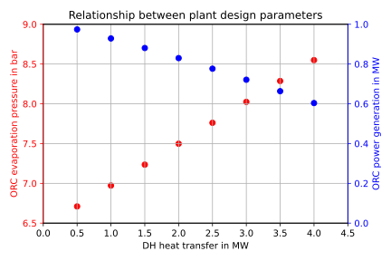

# Geothermal ORC combined heat and power plant for New Town

Application of [TESPy][] for a combined heat and power ORC using a geothermal
high temperature heat source. This repository only contains the geothermal ORC
simulation models, the district heat system itself is not simulated.

## Model description

A time series of geothermal production temperature for different geothermal
mass flows, i.e. 30 kg/s, 40 kg/s and 50 kg/s, is provided in quarterly data,
assuming constant geothermal production for three months.

The simulation model calculates the power output of the geothermal ORC
following a heat demand curve. For that, the maximum monthly heat demand is
mapped to the design heat production of the plant and the heat production for
the other months is scaled respectively. The waste heat from the ORC is
discharged into the lake.

## Plant layout

The ORC plant has the following topology - "hybrid parallel" - as suggested by
the researchers (Habka & Ajib, 2014) and (Van Erdeweghe et al., 2018).

<figure>

</figure>

*Habka, M., & Ajib, S. (2014). Investigation of novel, hybrid,*
*geothermal-energized cogeneration plants based on organic Rankine cycle.*
*Energy, 70, 212–222. https://doi.org/10.1016/j.energy.2014.03.114*

*Van Erdeweghe, S., Van Bael, J., Laenen, B., & D’haeseleer, W. (2018). Optimal*
*combined heat-and-power plant for a low-temperature geothermal source. Energy,*
*150, 396–409. https://doi.org/10.1016/j.energy.2018.01.136*

The reinjection of the geothermal fluid is constrained to a minimum temperature
value of 90 °C (for the case studies conducted here). Its value can be modified
in the input file.

In the design, the Temperature values at 24 and 26 are set to this temperature
value. The evaporation temperature/pressure inside the orc power cycle is then
calculated based on the heat demand specification in the input file. The
relationship between design heat demand and evaporation pressure as well as
power generation is shown in the figure below. The lake pump is controlled in a
way, that temperature increase in the condenser is 10 °C at all times. That
means that the lake water mass flow changes with the power production of the
ORC power cycle. The design parameters of the cycle are listed in the table
below the figure. The remaining design parameters are controlled with the input
file (see Usage section).

<figure>

</figure>

|                 | Parameter                | Value  | Unit |
|-----------------|--------------------------|--------|------|
| turbine         | efficiencies (is, el)    | 90, 97 | %    |
| pumps           | efficiencies (is, el)    | 75, 97 | %    |
| condenser       | temperature difference   |     10 | °C   |
|                 | pressure ratio hot side  |      1 | -    |
| evaporator      | pinch point              |     10 | °C   |
|                 | pressure ratio cold side |      1 | -    |
| preheater       | temperature difference   |      3 | °C   |
| heat exchangers | pressure ratios          |   0.98 | -    |
| lake water      | temperature increase     |     10 | °C   |

Partload operation is simulated by applying characteristic curves for the
efficiency of heat transfer and turbines as well as pumps. The temperatures 24
and 26 are fixed to the minimum reinjection temperature. However, in case the
ORC power cycle is overloaded, the temperature value 26 increases to values
higher than the minimum reinjection temperature. This occurs, when the working
fluid mass flow increases with lower heat demand. The turbine then requires
higher pressure at the inlet to deal with the increased mass flow and therefore
the pressure ratio over the valve becomes larger than 1, which is physically
impossible. In this case the pressure ratio is set to 1 instead of setting the
temperature 26 (valve is fully opened).

**Please note, that the district heating system temperature does not influence**
**the other components of the plant in this control strategy.** By keeping
temperature 24 value constant at the reinjection temperature, the feed
temperature of the district heating system cannot be controlled within the
district heating heat exchanger anymore. However, partially bypassing the heat
exchanger and mixing the cold return flow with the too hot feed flow from the
heat exchanger, the temperature value can be brought down to the appropriate
level without changing the overall heat input. The district heating water
circulation is therefore increased. Since this does not affect the operation of
the ORC system, it is not part of the simulation.

## Usage

Clone the repository and build a new `python3.8` environment and install the
requirements to it.

``` bash
pip install -r ./requirements.txt
```

To run the simulation type

``` bash
python run.py input/inputfile.json
```

in your console.

Please exchange the "inputfile.json" with the respective scenario you want to
simulate, e.g. "high_temp_dh_1500.json". It is possible to specify the working
fluid of the ORC, some design parameters like heat production and geothermal
source temperature as well as the reinjection temperature constraint.

**The tool is quite flexibile in parameter settings, if you want to learn more**
**on how to change parameters, please contact us.**

## Citation

The state of this repository is archived via zenodo. If you are using the
TESPy model within your own research, you can refer to this model via the
zenodo doi: [10.5281/zenodo.6592257][].

## MIT License

Copyright (c) 2022 Francesco Witte, Nicholas Fry

Permission is hereby granted, free of charge, to any person obtaining a copy
of this software and associated documentation files (the "Software"), to deal
in the Software without restriction, including without limitation the rights
to use, copy, modify, merge, publish, distribute, sublicense, and/or sell
copies of the Software, and to permit persons to whom the Software is
furnished to do so, subject to the following conditions:

The above copyright notice and this permission notice shall be included in all
copies or substantial portions of the Software.

THE SOFTWARE IS PROVIDED "AS IS", WITHOUT WARRANTY OF ANY KIND, EXPRESS OR
IMPLIED, INCLUDING BUT NOT LIMITED TO THE WARRANTIES OF MERCHANTABILITY,
FITNESS FOR A PARTICULAR PURPOSE AND NONINFRINGEMENT. IN NO EVENT SHALL THE
AUTHORS OR COPYRIGHT HOLDERS BE LIABLE FOR ANY CLAIM, DAMAGES OR OTHER
LIABILITY, WHETHER IN AN ACTION OF CONTRACT, TORT OR OTHERWISE, ARISING FROM,
OUT OF OR IN CONNECTION WITH THE SOFTWARE OR THE USE OR OTHER DEALINGS IN THE
SOFTWARE.


  [TESPy]: https://github.com/oemof/tespy
  [10.5281/zenodo.6592257]: https://zenodo.org/record/6592257
